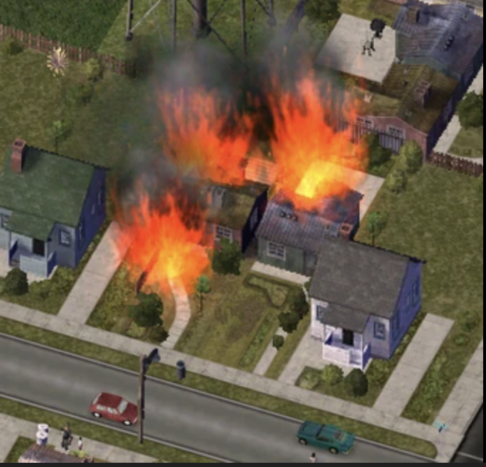

<div align="center">

## 🚨 Patronet OpenEnv — Emergency Response RL Environment

[](https://python.org)
[](https://fastapi.tiangolo.com)
[](https://github.com/meta-llama/openenv)
[](https://github.com/huggingface/trl)
[](https://docker.com)
[](https://github.com/astral-sh/uv)

</div>



> **OpenEnv-compatible MDP** for emergency triage & responder dispatch. Train LLM agents with **GRPO**, **dense + sparse rewards**, and **verifier-based** scoring — all behind a **FastAPI** HTTP API.

---

### 📋 At a glance

| | |
|---|---|
| **What** | RL environment: triage victim → dispatch correct responder within step budget |
| **Stack** | OpenEnv, FastAPI, GRPOTrainer (TRL), Docker, **uv** |
| **MDP** | State (victim, responders, time) → Actions (triage, route, wait) → Dense + sparse rewards + verifiers |

---

### 🗂 Project layout

| Path | Role |
|------|------|
| `patronet/env.py` | Core MDP: state, `step()`, transitions, deterioration |
| `patronet/environment.py` | OpenEnv adapter (`Environment` interface) |
| `patronet/models.py` | `PatronetAction`, `PatronetObservation` (Pydantic) |
| `patronet/rubric.py` | Dense rewards (per-step) + sparse (episode-end) + verifiers |
| `patronet/app.py` | FastAPI server (`/reset`, `/step`, `/schema`, `/health`) |
| `patronet/client.py` | HTTP client for remote env |
| `patronet/train.py` | GRPO `rollout_func`: reset → LLM actions → step → reward |
| `data/ontology.json` | Crisis types → valid responders, escalation, time window |
| `data/triage.json` | Crisis type → question tags (triage bank) |
| `frontend/` | Web UI to run & visualize episodes |

---

---
title: Patronet Emergency Environment Server
emoji: 🚨
colorFrom: red
colorTo: blue
sdk: docker
app_port: 8000
tags: [openenv, rl, grpo, fastapi]
---
<div align="center">

### ⚡ Quick start

```bash
uv sync
uv run python -m patronet.app   # Server at http://localhost:8000
```

**Client:**

```python
from patronet.client import PatronetEmergencyEnv

with PatronetEmergencyEnv(base_url="http://localhost:8000") as env:
    obs = env.reset()
    obs, reward, done, info = env.step(action)
```
---

### 🔧 Actions & rewards (summary)

| Actions | Description |
|---------|-------------|
| `triage_assess` | Ask victim a question by `question_tag` (from triage bank) |
| `route_responder` | Dispatch by `responder_type` (valid per ontology) |
| `wait` | Pass step (penalized if victim deteriorating/critical) |

| Reward type | Examples |
|-------------|----------|
| **Dense** (per step) | Triage +8 / −5, routing +20 / −15, idle −15, deterioration −15 |
| **Sparse** (episode end) | Rescue +50, partial +20, failure −50 |
| **Verifiers** | Rescue, triage, routing scores in [0, 1] for curriculum/replay |

---

### 📐 Key constants

| Constant | Value |
|----------|--------|
| Step budget | 20 (medium pressure) |
| Deterioration | stable 90s → deteriorating 150s → critical 300s |
| Responder ETA (dense_urban) | 4 min base |
| Tool durations | triage 15s, route 3s, wait 15s |

---

### 🌐 OpenEnv HTTP API

| Endpoint | Purpose |
|----------|---------|
| `POST /reset` | New episode → initial observation |
| `POST /step` | Send action (JSON) → observation, reward, done, info |
| `GET /schema` | Action & observation JSON schemas |
| `GET /health` | Liveness |

---

### 🧪 Commands

| Task | Command |
|------|---------|
| Run server | `uv run python -m patronet.app` |
| Tests | `uv run pytest tests/` |
| Lint / format | `uv run ruff check .` · `uv run ruff format .` |
| Train (GRPO) | `uv run python -m patronet.train --model Qwen/Qwen2.5-3B-Instruct --num_episodes 256` |
| Docker | `docker build -f server/Dockerfile -t patronet-openenv .` |

---

### 📚 More

- **data/** — extend crisis types and triage questions via JSON; no code change needed for new scenarios.

---

#### 📬 Let’s connect

Feedback, questions, or contributions? Open an issue or fork the repo.

<p align="center">
  <a href="https://www.linkedin.com/in/mansimore9/"></a>
  <a href="https://github.com/MansiMore99"></a>
  <a href="https://medium.com/@mansi.more943"></a>
  <a href="https://x.com/MansiMore99"></a>
  <a href="https://www.youtube.com/@tech_girl-m9"></a>
</p>
